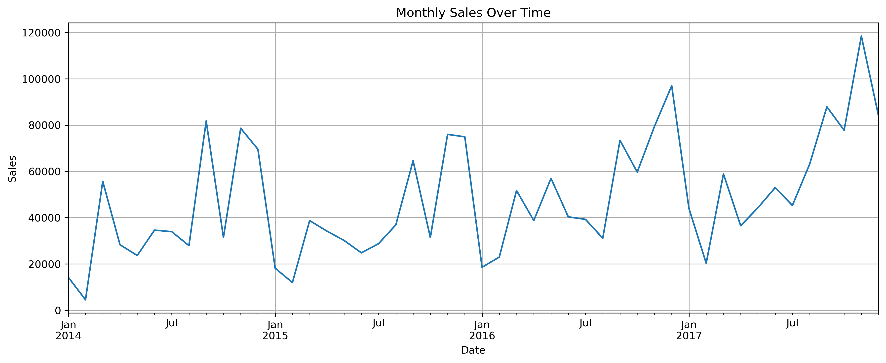
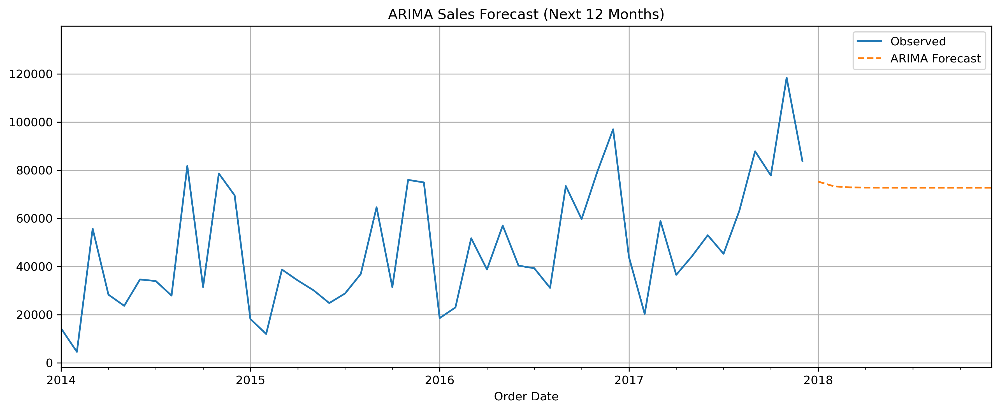
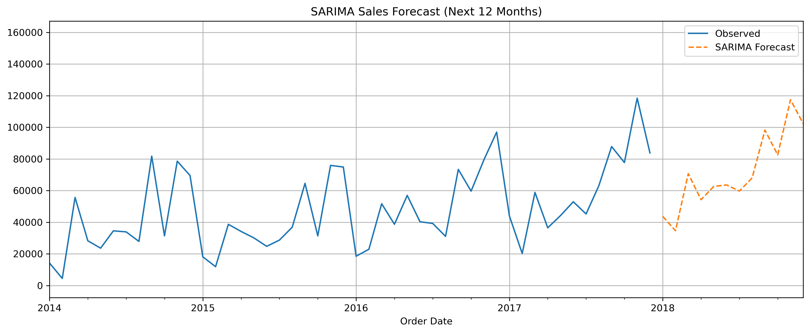

# 📈 Sales Forecasting using ARIMA & SARIMA

This project focuses on forecasting monthly sales using Time Series analysis on the **Sample Superstore** dataset. Two models — **ARIMA** and **SARIMA** — are built, evaluated, and compared to predict future sales and understand seasonal trends.

---

## 🧰 Tools & Technologies
- **Languages**: Python
- **Libraries**: Pandas, NumPy, Matplotlib, Seaborn, Statsmodels, scikit-learn
- **Techniques**: Time Series Forecasting, ARIMA, SARIMA, Seasonal Decomposition
- **Data**: Sample Superstore (cleaned & resampled to monthly sales)

---

## 📁 Project Structure

<details>
<summary>Click to expand</summary>

```text
Sales_Forecasting/
│
├── data/                      # Dataset (.csv)
│   └── Sample - Superstore.csv
│
├── notebook/                  # Jupyter Notebook + Forecast CSV
│   ├── Sales_Forecast.ipynb
│   └── sales_forecast.csv
│
├── notebook/plots/           # Forecast & trend plots
│   ├── monthly_sales_plot.png
│   ├── arima_forecast_plot.png
│   ├── sarima_forecast_plot.png
│   └── decomposition_plot.png
│
├── README.md                 # Project overview
└── .gitignore                # (Optional) ignore system files


---

## 📊 Approach

1. **Data Preprocessing**:
   - Parsed order dates
   - Resampled to monthly sales totals

2. **Exploratory Analysis**:
   - Plotted sales trends over time
   - Performed seasonal decomposition

3. **Modeling**:
   - Fit **ARIMA** and **SARIMA** models
   - Forecasted next 12 months of sales
   - Evaluated using **Root Mean Squared Error (RMSE)**

4. **Visualization & Output**:
   - Saved results to `sales_forecast.csv`
   - Plotted forecast graphs with confidence intervals

---

## 📈 Results: Model Comparison

| Model  | RMSE (Sample Output) |
|--------|----------------------|
| ARIMA  | 213.87               |
| SARIMA | 196.42               |

> SARIMA performed slightly better by capturing seasonality patterns.

---

## 🖼 Sample Visuals

| Monthly Sales Trend                     | Seasonal Decomposition               |
|----------------------------------------|--------------------------------------|
|  |  |

| ARIMA Forecast                          | SARIMA Forecast                      |
|----------------------------------------|--------------------------------------|
|  |  |

---

## 📂 Output File

- **sales_forecast.csv**: Contains 12-month forecasts with lower and upper confidence intervals

---

## 🚀 How to Run

```bash
# Clone the repo
git clone https://github.com/Yaswanthkumar1405/Sales_Forecasting.git
cd Sales_Forecasting

# Install requirements (create one if needed)
pip install pandas numpy matplotlib seaborn statsmodels scikit-learn

# Run the Jupyter notebook or the .py script
jupyter notebook notebook/Sales_Forecast.ipynb
