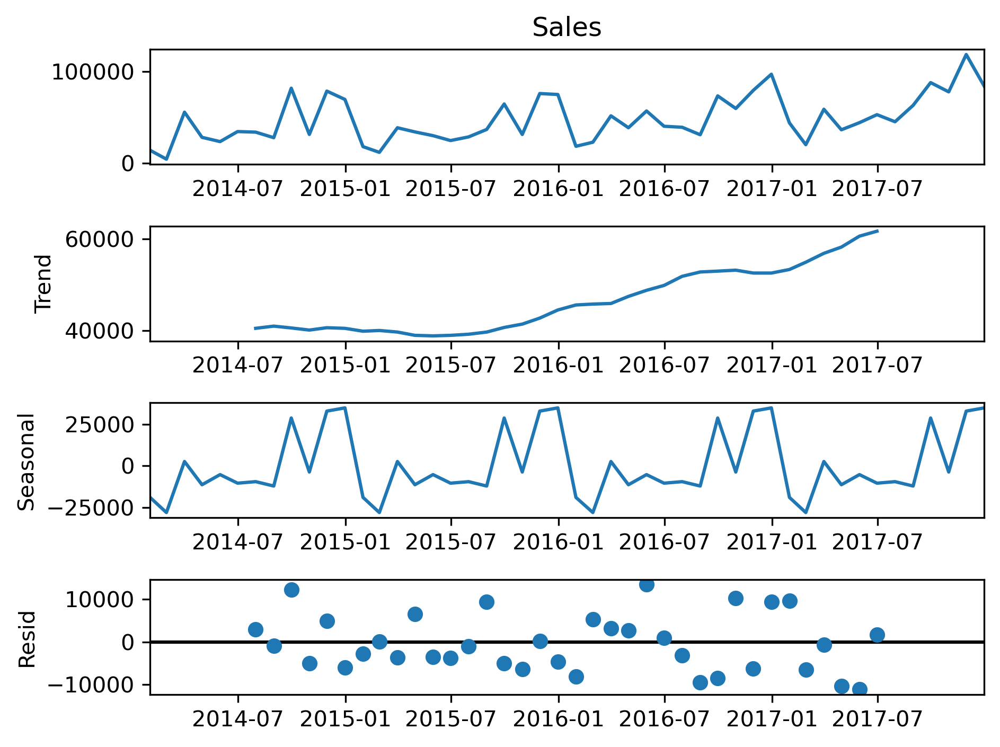

# 📈 Sales Forecasting using ARIMA & SARIMA

Forecasting monthly sales using Time Series Analysis on the Superstore dataset.  
This project builds and compares ARIMA and SARIMA models to predict future sales and understand seasonal trends.

---

## 🧠 Objective

To forecast monthly sales using historical data from the Superstore dataset. The goal is to compare ARIMA and SARIMA models in capturing trend and seasonality for better business planning.

---

## 🧰 Tools & Technologies

- **Language:** Python  
- **Libraries:** Pandas, NumPy, Matplotlib, Seaborn, Statsmodels, scikit-learn  
- **Techniques:** Time Series Forecasting, ARIMA, SARIMA, Seasonal Decomposition  
- **Data:** Sample Superstore (cleaned & resampled to monthly sales)

---

## 📁 Project Structure

<details>
<summary>Click to expand</summary>

```text
Sales_Forecasting/
│
├── data/
│   └── Sample - Superstore.csv
│
├── notebook/
│   ├── Sales_Forecast.ipynb
│   ├── sales_forecast.csv
│   └── plots/
│       ├── arima_forecast_plot.png
│       ├── decomposition_plot.png
│       ├── monthly_sales_plot.png
│       └── sarima_forecast_plot.png
│
├── .gitignore
├── README.md


```
</details>


---

## 📊 Approach

1. **Data Preprocessing**:
   - Parsed order dates
   - Resampled to monthly sales totals

2. **Exploratory Analysis**:
   - Plotted sales trends over time
   - Performed seasonal decomposition

3. **Modeling**:
   - Fit **ARIMA** and **SARIMA** models
   - Forecasted next 12 months of sales
   - Evaluated using **Root Mean Squared Error (RMSE)**

4. **Visualization & Output**:
   - Saved results to `sales_forecast.csv`
   - Plotted forecast graphs with confidence intervals

---

## 📊 Forecast Visualizations

Below are key visual outputs from the ARIMA and SARIMA models. They show trend behavior, decomposition of time series components, and 12-month sales forecasts.

> *(Plots are embedded directly below in the README)*

---

## 📈 Results: Model Comparison

| Model  | RMSE (Sample Output) |
|--------|----------------------|
| ARIMA  | 213.87               |
| SARIMA | 196.42               |

> SARIMA performed slightly better by capturing seasonality patterns.

---

## 🖼 Sample Visuals

| Monthly Sales Trend                     | Seasonal Decomposition               |
|----------------------------------------|--------------------------------------|
|  |  |

| ARIMA Forecast                          | SARIMA Forecast                      |
|----------------------------------------|--------------------------------------|
|  |  |

---

## 📂 Output File

- **sales_forecast.csv**: Contains 12-month forecasts with lower and upper confidence intervals

---

## 🚀 How to Run

```bash
# Clone the repo
git clone https://github.com/Yaswanthkumar1405/Sales_Forecasting.git
cd Sales_Forecasting

# Install dependencies (create requirements.txt if needed)
pip install pandas numpy matplotlib seaborn statsmodels scikit-learn

# Launch the notebook
jupyter notebook notebook/Sales_Forecast.ipynb

---

## 📬 Contact

👨‍💻 **Developed by:** Yaswanth Kumar Chaganti  
📧 [yaswanthkumarchaganti@gmail.com](mailto:yaswanthkumarchaganti@gmail.com)  
🔗 [LinkedIn](https://www.linkedin.com/in/yaswanth-kumar-chaganti)  
💻 [GitHub](https://github.com/Yaswanthkumar1405)

